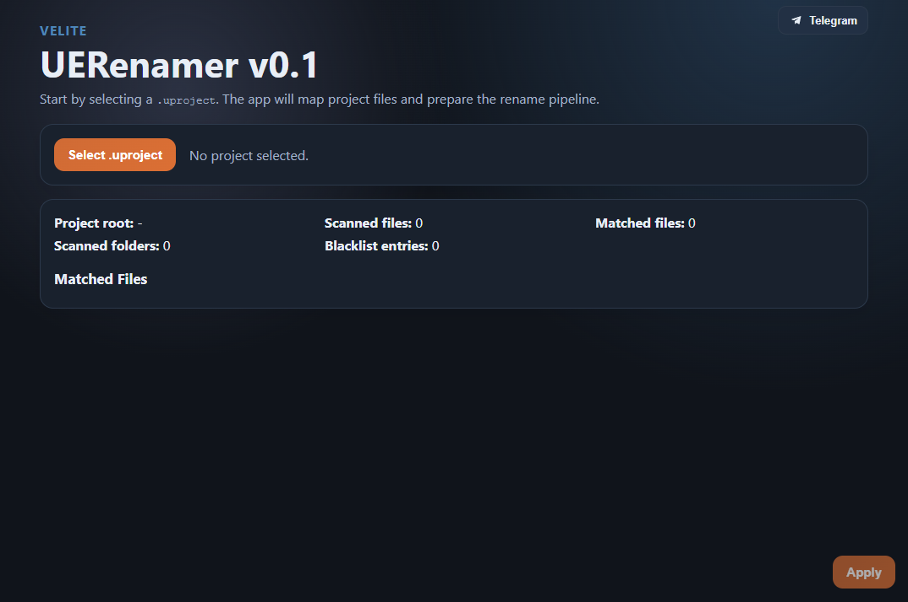

  

# 🛠️ UERenamer v0.2

**UERenamer** — это инструмент для полного переименования проектов на Unreal Engine.

## 🚀 Основные фичи

* **Глубокий рефакторинг:** Автоматическая замена имени проекта во всех файлах (`.uproject`, `.sln`, `.Target.cs`, `.Build.cs` и др.).
* **CoreRedirects:** Генерация строк перенаправления для `DefaultEngine.ini`
* **Превью изменений:** Отображение тех файлов и папок, которые подвергнутся изменениям
* **API Macro Handling:** Автоматическая замена макросов (например, `OLDPROJECT_API` -> `NEWPROJECT_API`).
* **Гибкие исключения:** Настраиваемый черный список папок и файлов.

## 📂 Что именно меняется

| Параметр | Значение |
|---|---|
| Сканируемые папки | Корень проекта + `Config`, `Source`, `Plugins` |
| Папки-исключения (по умолчанию) | `.git`, `.idea`, `.vs`, `Binaries`, `DerivedDataCache`, `Intermediate`, `Saved`, `node_modules`, `__ExternalActors__`, `__ExternalObjects__` |
| Поддерживаемые типы файлов (путь/содержимое) | `.uproject`, `.uplugin`, `.ini`, `.cs`, `.h`, `.cpp`, `.hpp`, `.c`, `.cc`, `.sln`, `.vcxproj`, `.vcxproj.filters` |
| Правила замены | Старое имя проекта (без учета регистра) + API-макрос (`OLDPROJECT_API` -> `NEWPROJECT_API`) |

## ❌ Ограничения
* На данный момент нет функционала по автоматическому бекапу изменяемых файлов
* Если ранее вы изменяли наименование проекта в некоторых файлах, алгоритм может не справиться из-за расхождения имён

## ⚡ Инструкция

ДЕЛАЙТЕ ПОЛНЫЙ БЕКАП ПРОЕКТА. ПРОГРАММА В ДАННЫЙ МОМЕНТ НЕ РЕАЛИЗУЕТ АВТОМАТИЧЕСКИЙ БЕКАП ИЗМЕНЕННЫХ ФАЙЛОВ

* Выберите .uproject файл в директории вашего проекта
* По ненадобности отключите CoreRedirects
* Нажмите 'Preview'
* Просмотрите список файлов и папок, которые подвергнутся изменениям
* По необходимости вы можете исключить конкретные файлы или папки, а исключая папку, вы можете включить конкретные файлы (whitelist)
* Нажмите 'apply', подтвердите действие, и ваш проект будет переименован в течение секунды
* Если процесс прошел успешно, просто запустите проект через .uproject файл. Unreal Engine автоматически предложит сделать rebuild. Соглашаясь, создаст необходимые файлы и папки, а после запустит проект. В случае, если rebuild выдаст ошибку, попробуйте удалить в корне проекта папки intermediate, binaries, .vs, .idea, derivedDataCache, и попробовать снова запустить проект. Помимо этого рекомендуется делать полный ребилд проекта непосредственно в вашей IDE

## 📱 Ссылки

* Телеграм канал: https://t.me/velitelink
